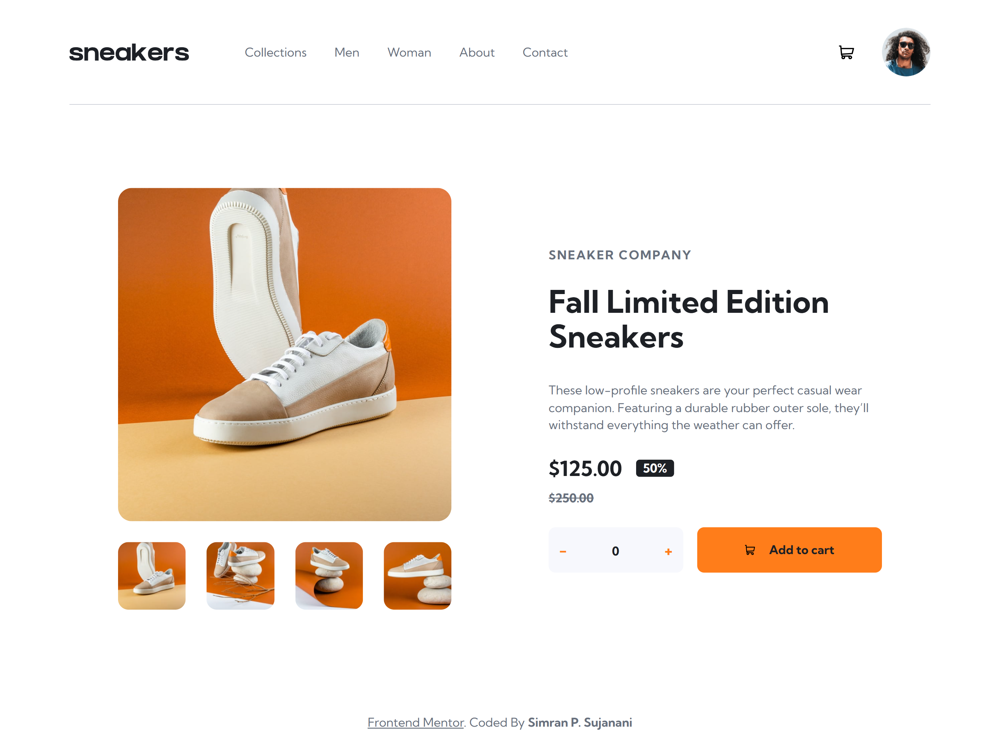
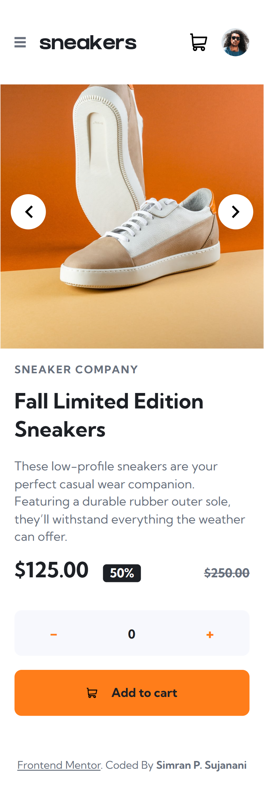

# Frontend Mentor - E-commerce product page solution

This is a solution to the [E-commerce product page challenge on Frontend Mentor](https://www.frontendmentor.io/challenges/ecommerce-product-page-UPsZ9MJp6). Frontend Mentor challenges help you improve your coding skills by building realistic projects.

## Table of contents

- [Overview](#overview)
  - [The challenge](#the-challenge)
  - [Screenshot](#screenshot)
  - [Links](#links)
- [My process](#my-process)
  - [Built with](#built-with)
  - [What I learned](#what-i-learned)
  - [Continued development](#continued-development)
  - [AI Collaboration](#ai-collaboration)
- [Author](#author)

## Overview

### The challenge

Users should be able to:

- View the optimal layout for the site depending on their device's screen size
- See hover states for all interactive elements on the page
- Open a lightbox gallery by clicking on the large product image
- Switch the large product image by clicking on the small thumbnail images
- Add items to the cart
- View the cart and remove items from it

### Screenshot




### Links

- Solution URL: [https://www.frontendmentor.io/solutions/ecommerce-product-page-main-using-tailwindcss-and-javascript-MVJl7Ko1d6](https://www.frontendmentor.io/solutions/ecommerce-product-page-main-using-tailwindcss-and-javascript-MVJl7Ko1d6)
- Live Site URL: [https://sim-ps.github.io/ecommerce-product-page-main-using-TailwindCSS-Javascript/](https://sim-ps.github.io/ecommerce-product-page-main-using-TailwindCSS-Javascript/))

## My process

### Built with

- Semantic HTML5 markup
- CSS custom properties
- Flexbox
- CSS Grid
- Vanilla JavaScript
- [Tailwind CSS v4](https://tailwindcss.com/) - Utility-first CSS framework
- [Vite](https://vitejs.dev/) - Frontend build tool

### What I learned

Working on this project taught me a lot about Tailwind CSS v4's new approach — using `@theme` in CSS instead of a config file, and the new `@tailwindcss/vite` plugin. I also got comfortable with vanilla JavaScript DOM manipulation for interactive features like the lightbox, cart, and quantity selector.

Some code I'm proud of:

```js
// Reusable counter function
function onClickCounter(minusBtn, plusBtn, min = 0) {
  let count = 0

  const update = () => {
    document
      .querySelectorAll('.display')
      .forEach((el) => (el.textContent = count))
    document.querySelector('#totalAmount').textContent = `$${125 * count}`
    if (count > 0) {
      document.querySelector('#hasItems').classList.remove('invisible')
      document.querySelector('#isEmpty').classList.add('invisible')
    } else {
      document.querySelector('#hasItems').classList.add('invisible')
      document.querySelector('#isEmpty').classList.remove('invisible')
    }
  }

  document.querySelector(plusBtn).addEventListener('click', () => {
    count++
    update()
  })
  document.querySelector(minusBtn).addEventListener('click', () => {
    if (count > min) {
      count--
      update()
    }
  })
}
```

```css
/* Custom theme tokens in Tailwind v4 */
@theme {
  --breakpoint-mobile: 375px;
  --breakpoint-desktop: 1440px;
  --color-orange: hsl(26, 100%, 55%);
  --color-very-dark-blue: hsl(220, 13%, 13%);
}
```

### Continued development

- Improve accessibility (keyboard navigation, ARIA labels)
- Explore React to handle state more cleanly instead of manual DOM manipulation
- Learn CSS animations for smoother lightbox and cart transitions
- Implement the delete item from cart functionality

### AI Collaboration

I used **Claude (Anthropic)** throughout this project as a learning assistant.

- **How I used it:** Debugging layout issues, understanding Tailwind v4 concepts like `@theme` and `@source`, learning vanilla JS patterns for the lightbox and cart, and getting guidance on semantic HTML and SEO best practices.
- **What worked well:** Having instant explanations for why something wasn't working (e.g. `absolute` needing a `relative` parent, `fill` not working on `` tags) sped up my learning significantly.
- **What didn't:** AI suggestions sometimes needed adjusting to fit my specific HTML structure, so I still had to understand the code rather than just copy-paste.

## Author

- Frontend Mentor - [@HotChickenCurry](https://www.frontendmentor.io/profile/HotChickenCurry)
- GitHub - [@sim-ps](https://github.com/sim-ps)
